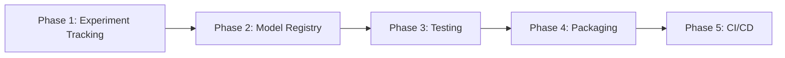

# MLOps Implementation Plan — VC Stock Prediction

## Background

The project already has a solid foundation:
- **DVC** for data pipeline versioning (`dvc.yaml`, `params.yaml`)
- **Data pipeline** scripts in `src/data/` and `src/features/`
- **Main model** in `vcStockPredictionEnsemble.py` (ensemble of Transformer-based models)
- **Kaggle launcher** (`run.py`) for remote GPU execution
- **App layer** (`app_backend/`, `app_ui/`) for inference serving
- **Makefile** + `tox.ini` for build automation

This plan adds the remaining MLOps layers — from experiment tracking through a full CI/CD pipeline — in 5 sequential phases.

---

## Phase 1 — Experiment Tracking (MLflow + DagsHub)

> [!NOTE]
> MLflow is already partially referenced in the Kaggle pip-injection in `run.py` (`pip install mlflow dagshub`). This phase formally integrates it.

### What changes

#### [MODIFY] [vcStockPredictionEnsemble.py](file:///c:/xampp/htdocs/vc-stock-prediction-new/vcStockPredictionEnsemble.py)
- Wrap the training loop with `mlflow.start_run()`
- Log hyperparameters from `params.yaml` using `mlflow.log_params()`
- Log metrics each epoch: RMSE, MAE, MAPE, Sharpe ratio
- Log model artifacts: `mlflow.sklearn.log_model()` / `mlflow.pyfunc.log_model()`
- Log plots (attention maps, prediction charts) as artifacts

#### [NEW] [mlflow_config.py](file:///c:/xampp/htdocs/vc-stock-prediction-new/mlflow_config.py)
- Centralised setup: DagsHub remote URI, experiment name, tags
- Reads `MLFLOW_TRACKING_URI`, `DAGSHUB_TOKEN` from environment variables

#### [MODIFY] [params.yaml](file:///c:/xampp/htdocs/vc-stock-prediction-new/params.yaml)
- Add `mlflow:` section with `experiment_name`, `run_name_prefix`, `tracking_uri`

#### [MODIFY] [Makefile](file:///c:/xampp/htdocs/vc-stock-prediction-new/Makefile)
- Add `make mlflow-ui` target: `mlflow ui --backend-store-uri ./mlruns`

### Verification
```
python -c "import mlflow; print(mlflow.__version__)"
python vcStockPredictionEnsemble.py   # short run with reduced epochs
mlflow ui                             # open http://127.0.0.1:5000 — check run appears
```

---

## Phase 2 — Model Registry & Versioning

> [!IMPORTANT]
> This phase produces a **named, versioned, stage-tagged model** in the MLflow Model Registry, replacing the ad-hoc `Saved_Models/` folder approach.

### What changes

#### [MODIFY] [vcStockPredictionEnsemble.py](file:///c:/xampp/htdocs/vc-stock-prediction-new/vcStockPredictionEnsemble.py)
- On run completion, register best ensemble checkpoint:  
  `mlflow.register_model(model_uri, "vc-stock-ensemble")`
- Transition to stage `Staging` automatically; promote to `Production` only if metric threshold is met (e.g., test RMSE < threshold from `params.yaml`)

#### [NEW] [src/model/promote_model.py](file:///c:/xampp/htdocs/vc-stock-prediction-new/src/model/promote_model.py)
- Script that queries MLflow Registry, compares latest `Staging` vs current `Production` on a held-out metric, and conditionally promotes

#### [MODIFY] [dvc.yaml](file:///c:/xampp/htdocs/vc-stock-prediction-new/dvc.yaml)
- Add `train_model` and `evaluate_model` stages that call `vcStockPredictionEnsemble.py` and `src/model/promote_model.py`

#### [MODIFY] [params.yaml](file:///c:/xampp/htdocs/vc-stock-prediction-new/params.yaml)
- Add `model_registry:` section: `model_name`, `promotion_rmse_threshold`

### Verification
```
python src/model/promote_model.py --dry-run
# Check MLflow UI → Models tab → "vc-stock-ensemble" registry entry with versions
```

---

## Phase 3 — Robust Testing

> [!NOTE]
> `test_environment.py` and `test_api.py` already exist. This phase adds a proper `pytest` test suite with model quality gates.

### What changes

#### [NEW] [tests/](file:///c:/xampp/htdocs/vc-stock-prediction-new/tests/) directory structure
```
tests/
  __init__.py
  unit/
    test_data_pipeline.py     # scrape_news, build_datasets, calculate_sentiment
    test_feature_engineering.py
    test_model_components.py  # individual model forward passes with dummy tensors
  integration/
    test_dvc_pipeline.py      # dvc repro --dry — verify DAG integrity
    test_api_endpoints.py     # extends existing test_api.py
  model_quality/
    test_model_metrics.py     # load registered model, run on holdout, assert RMSE < threshold
```

#### [NEW] [pytest.ini](file:///c:/xampp/htdocs/vc-stock-prediction-new/pytest.ini)
- Configure test paths, markers (`unit`, `integration`, `model_quality`), and coverage settings

#### [MODIFY] [Makefile](file:///c:/xampp/htdocs/vc-stock-prediction-new/Makefile)
- Add `make test`, `make test-unit`, `make test-integration`, `make test-quality` targets

#### [MODIFY] [tox.ini](file:///c:/xampp/htdocs/vc-stock-prediction-new/tox.ini)
- Add tox environments that mirror CI matrix (Python 3.10, 3.11)

### Verification
```
pytest tests/unit/ -v
pytest tests/integration/ -v
pytest tests/model_quality/ -v
```

---

## Phase 4 — Packaging & Reproducibility

> [!WARNING]
> Currently `requirements.txt` has all packages commented out. This phase pins exact versions and adds a Docker image for reproducible training & inference.

### What changes

#### [MODIFY] [requirements.txt](file:///c:/xampp/htdocs/vc-stock-prediction-new/requirements.txt)
- Uncomment and pin all dependencies with exact versions (`pip freeze > requirements.txt` after a clean install)
- Split into `requirements.txt` (runtime) and `requirements-dev.txt` (lint, test, notebook tools)

#### [NEW] [Dockerfile](file:///c:/xampp/htdocs/vc-stock-prediction-new/Dockerfile)
```dockerfile
FROM python:3.11-slim
WORKDIR /app
COPY requirements.txt .
RUN pip install --no-cache-dir -r requirements.txt
COPY . .
ENTRYPOINT ["python", "vcStockPredictionEnsemble.py"]
```

#### [NEW] [docker-compose.yml](file:///c:/xampp/htdocs/vc-stock-prediction-new/docker-compose.yml)
- Services: `trainer` (GPU-enabled training), `inference-api` (app_backend FastAPI), `mlflow-server`

#### [MODIFY] [Makefile](file:///c:/xampp/htdocs/vc-stock-prediction-new/Makefile)
- Add `make docker-build`, `make docker-run-train`, `make docker-run-api`

#### [MODIFY] [.gitignore](file:///c:/xampp/htdocs/vc-stock-prediction-new/.gitignore)
- Add Docker build cache, `.env` files

### Verification
```
docker build -t vc-stock-predict:latest .
docker run --rm vc-stock-predict:latest python test_environment.py
```

---

## Phase 5 — CI/CD Pipeline (GitHub Actions)

> [!IMPORTANT]
> This is the culminating phase. Every push to `main` or a PR triggers the full pipeline automatically.

### What changes

#### [NEW] [.github/workflows/ci.yml](file:///c:/xampp/htdocs/vc-stock-prediction-new/.github/workflows/ci.yml)
```yaml
name: CI
on: [push, pull_request]
jobs:
  lint-and-test:
    runs-on: ubuntu-latest
    steps:
      - uses: actions/checkout@v4
      - uses: actions/setup-python@v5
        with: { python-version: "3.11" }
      - run: pip install -r requirements-dev.txt
      - run: flake8 src/
      - run: pytest tests/unit/ tests/integration/ -v --tb=short
  
  dvc-pipeline-check:
    needs: lint-and-test
    runs-on: ubuntu-latest
    steps:
      - uses: actions/checkout@v4
      - run: pip install dvc
      - run: dvc repro --dry   # validates DAG without running
  
  model-quality-gate:
    needs: dvc-pipeline-check
    runs-on: ubuntu-latest
    env:
      MLFLOW_TRACKING_URI: ${{ secrets.MLFLOW_TRACKING_URI }}
      DAGSHUB_TOKEN: ${{ secrets.DAGSHUB_TOKEN }}
    steps:
      - uses: actions/checkout@v4
      - run: pip install -r requirements.txt
      - run: pytest tests/model_quality/ -v
  
  docker-build:
    needs: model-quality-gate
    runs-on: ubuntu-latest
    steps:
      - uses: actions/checkout@v4
      - run: docker build -t vc-stock-predict:${{ github.sha }} .
```

#### [NEW] [.github/workflows/cd.yml](file:///c:/xampp/htdocs/vc-stock-prediction-new/.github/workflows/cd.yml)
- Triggered only on push to `main`
- Promotes the `Staging` model in MLflow Registry to `Production` via `src/model/promote_model.py`
- Optionally rebuilds and pushes Docker image to GitHub Container Registry (GHCR)

#### [NEW] [.github/workflows/scheduled_retrain.yml](file:///c:/xampp/htdocs/vc-stock-prediction-new/.github/workflows/scheduled_retrain.yml)
- Cron schedule (e.g., weekly): triggers DVC pipeline re-run → retrains → evaluates → promotes if better

#### [NEW] [.env.example](file:///c:/xampp/htdocs/vc-stock-prediction-new/.env.example)
- Template for local secrets: `MLFLOW_TRACKING_URI`, `DAGSHUB_TOKEN`, `KAGGLE_KEY`

### Verification
- Push a branch and open a PR — observe all CI checks pass in the GitHub Actions tab
- Merge to `main` — verify CD promotes model to `Production` in MLflow Registry

---

## Implementation Order



| Phase | Est. Effort | Key Deliverable |
|-------|-------------|-----------------|
| 1 — Experiment Tracking | ~2h | Every run logged to MLflow/DagsHub |
| 2 — Model Registry | ~1.5h | Named, staged model versions |
| 3 — Testing | ~3h | `pytest` unit + integration + quality gate |
| 4 — Packaging | ~1.5h | Pinned requirements + Docker image |
| 5 — CI/CD | ~2h | GitHub Actions: lint → test → gate → promote |

## Required Secrets (GitHub → Settings → Secrets)

| Secret | Purpose |
|--------|---------|
| `MLFLOW_TRACKING_URI` | DagsHub/self-hosted MLflow server URL |
| `DAGSHUB_TOKEN` | DagsHub API token |
| `KAGGLE_USERNAME` / `KAGGLE_KEY` | For scheduled Kaggle retraining |
